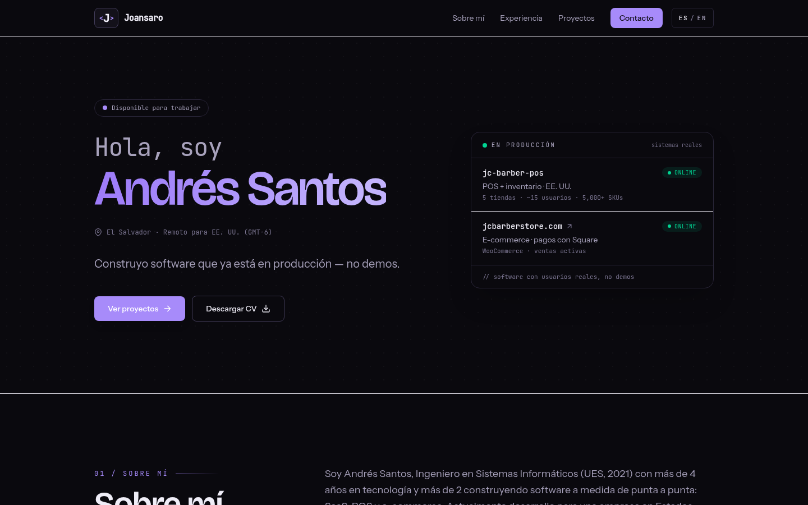
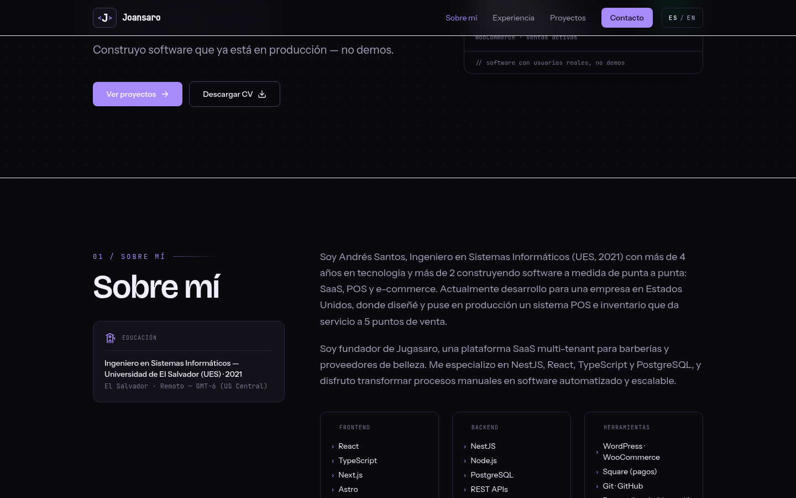
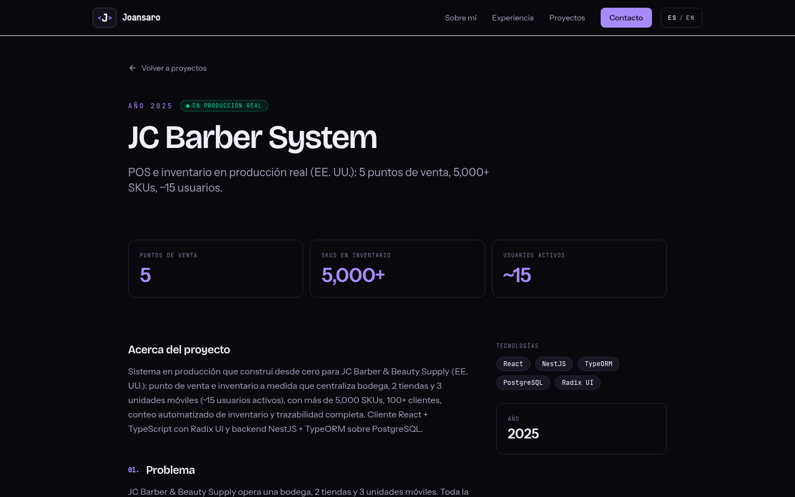

<h1 align="center">&lt;J&gt; joansaro.com</h1>

<p align="center"><strong>My personal portfolio — built around one idea: <em>I build software that's already in production, not demos.</em></strong></p>

<p align="center">
  
  
  
  
</p>

<p align="center">
  
</p>

## ✨ What makes it different

- 🟢 **"In production" panel in the hero** — a mission-control style card listing my real systems (POS running 5 stores in the US, a live e-commerce) with live-status chips, instead of the usual typewriter roles.
- 📊 **Case studies with real numbers** — problem → solution → outcome pages for production systems (5 points of sale, 5,000+ SKUs, ~15 active users), including private-code projects.
- 🌐 **Fully bilingual (ES/EN)** — every page, meta tag and case study, with smart language detection and hreflang.
- 🖨️ **Online CV page** (`/cv`) — print-ready, with downloadable PDFs in both languages.
- ⚡ **Static output** — 23 pages, sitemap, JSON-LD (Person), OG image, dark-only design system with a lilac accent.

## 🧱 Stack & structure

```
src/
├── components/       # Hero, ProductionStatus, Projects, Nav, …
├── data/profile.ts   # single source of truth: bio, stack, timeline, projects
├── i18n/             # ui.ts (strings) + utils (routing ES / /en)
├── layouts/          # BaseLayout: SEO, OG, JSON-LD, fonts
└── pages/            # index, cv, projects/[slug] (+ /en mirrors)
```

Fonts: Bricolage Grotesque (display) · Instrument Sans (body) · JetBrains Mono. All content lives in `src/data/profile.ts` and `src/i18n/ui.ts` — no CMS needed.

## 🚀 Quick start

```bash
npm install
npm run dev       # http://localhost:4321
npm run build     # 23 static pages → dist/
```

## 📸 Screens

| Projects — real systems first | Case study |
|---|---|
|  |  |

---

<p align="center"><a href="https://joansaro.com">joansaro.com</a> · Built by <a href="https://github.com/joansaro">Andrés Santos</a></p>
